# Jarkom-Modul-2-B08-2022

## Anggota Kelompok
<table>
 	<tr>
 		<td> Nama </td>
 		<td> NRP</td>
 	</tr>
 	<tr>
 		<td> Aaliyah Farah Adibah </td>
 		<td> 5025201070 </td>
 	</tr>
  <tr>
 		<td> Rafael Asi Kristanto Tambunan </td>
 		<td> 5025201168 </td>
 	</tr>
  <tr>
 		<td> Sejati Bakti Raga </td>
 		<td> 5025201007 </td>
 	</tr>
 </table>
 
 ## Daftar Isi
  + [Intro Soal](#intro-soal)
  + [Soal 1](#soal-1)
  + [Soal 2](#soal-2)
  + [Soal 3](#soal-3)
  + [Soal 4](#soal-4)
  + [Soal 5](#soal-5)
  + [Soal 6](#soal-6)
  + [Soal 7](#soal-7)
  + [Soal 8](#soal-8)
  + [Soal 9](#soal-9)
  + [Soal 10](#soal-10)
  + [Soal 11](#soal-11)
  + [Soal 12](#soal-12)
  + [Soal 13](#soal-13)
  + [Soal 14](#soal-14)
  + [Soal 15](#soal-15)
  + [Soal 16](#soal-16)
  + [Soal 17](#soal-17)
  + [Kendala](#kendala)

## Intro Soal
***Twilight (〈黄昏 (たそがれ) 〉, <Tasogare>) adalah seorang mata-mata yang berasal dari negara Westalis. Demi menjaga perdamaian antara Westalis dengan Ostania, Twilight dengan nama samaran Loid Forger (ロイド・フォージャー, Roido Fōjā) di bawah organisasi WISE menjalankan operasinya di negara Ostania dengan cara melakukan spionase, sabotase, penyadapan dan kemungkinan pembunuhan. Berikut adalah peta dari negara Ostania:***
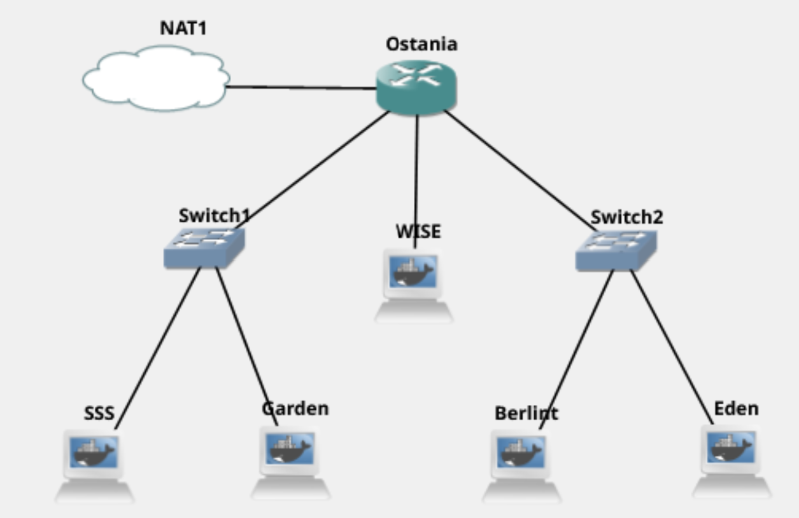

Dikarenakan gambaran peta tersebut, dibuat peta yang sama di GNS
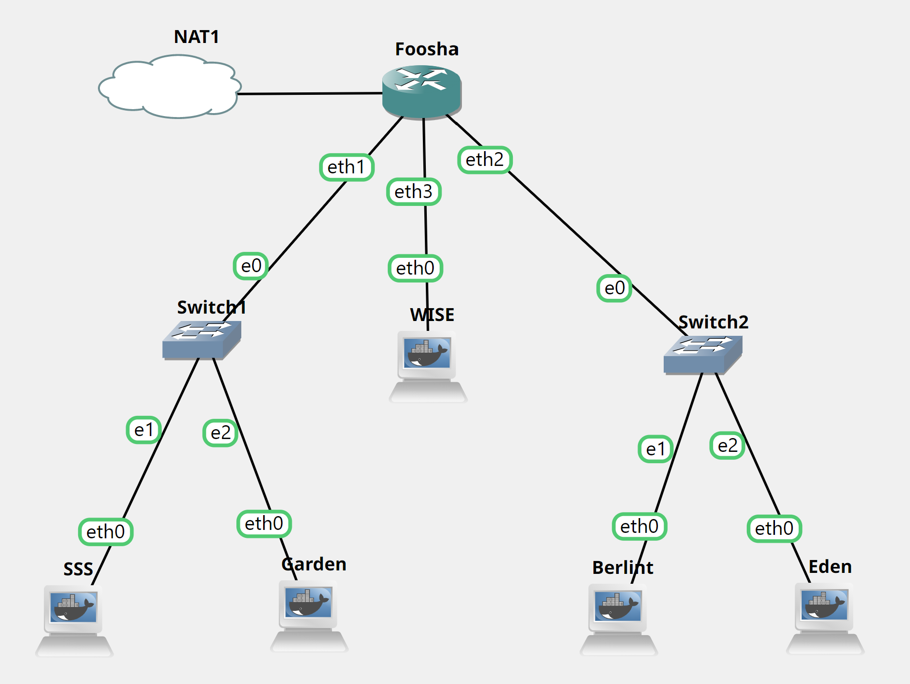

Lalu, lakukan pengaturan node. Sesuai yang telah ditetapkan, kelompok BO8 memiliki prefik 10.7 sehingga menjadi

**Foosha**                            
```
auto eth0
iface eth0 inet dhcp

auto eth1
iface eth1 inet static
	address 10.7.1.1
	netmask 255.255.255.0

auto eth2
iface eth2 inet static
	address 10.7.2.1
	netmask 255.255.255.0

auto eth3
iface eth3 inet static
	address 10.7.3.1
	netmask 255.255.255.0
 ```
 
 **WISE** 
 ```
auto eth0
iface eth0 inet static
	address 10.7.3.2
	netmask 255.255.255.0
	gateway 10.7.3.1
 ```
 
 **SSS** 
 ```
auto eth0
iface eth0 inet static
	address 10.7.1.2
	netmask 255.255.255.0
	gateway 10.7.1.1
 ```
 
 **Garden** 
 ```
auto eth0
iface eth0 inet static
	address 10.7.1.3
	netmask 255.255.255.0
	gateway 10.7.1.1
 ```
 
 **Berlint** 
 ```
 auto eth0
 iface eth0 inet static
	address 10.7.2.2
	netmask 255.255.255.0
	gateway 10.7.2.1
 ```
 
 **Eden** 
 ```
 auto eth0
 iface eth0 inet static
	address 10.7.2.3
	netmask 255.255.255.0
	gateway 10.7.2.1
 ```
 
## Soal 1
***WISE akan dijadikan sebagai DNS Master, Berlint akan dijadikan DNS Slave, dan Eden akan digunakan sebagai Web Server. Terdapat 2 Client yaitu SSS, dan Garden. Semua node terhubung pada router Ostania, sehingga dapat mengakses internet***<br><br>
Pada Foosha dibuat script yang berisi seperti di bawah agar semua node dapat terhubung dengan rooter sehingga dapat mengakses internet. 
 ```
 apt-get update
 iptables -t nat -A POSTROUTING -o eth0 -j MASQUERADE -s 10.7.0.0/16
 ```
 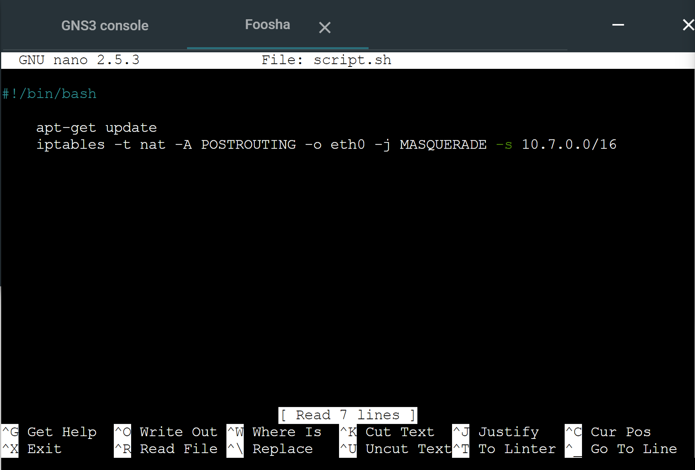
 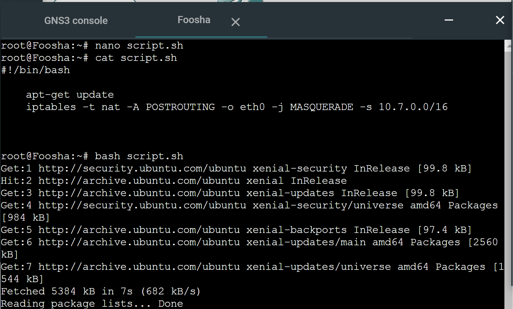
 <br>
 Lalu, pada setiap node dibuat perintah sebagai berikut
 ```
 echo "nameserver 192.168.122.1" > /etc/resolv.conf
 ```
 Coba untuk `apt-get update` atau `ping google.com` untuk mengetahui apakah sudah bisa mengakses internet
 <br>
 
Menjadikan WISE sebagai DNS Master
```
apt-get install bind9 -y

echo 'zone "wise.b08.com" {
type master;
file "/etc/bind/wise/wise.b08.com";
};'
```

Menjadikan Berlint sebagai DNS Slave
	
```
apt-get install bind9 -y

echo '
zone "wise.b08.com" {
        type slave;
        masters { 10.7.3.2; }; // Masukan IP Wise
        file "/var/lib/bind/wise.b08.com";
};
' > /etc/bind/named.conf.local
```

**TESTING**
 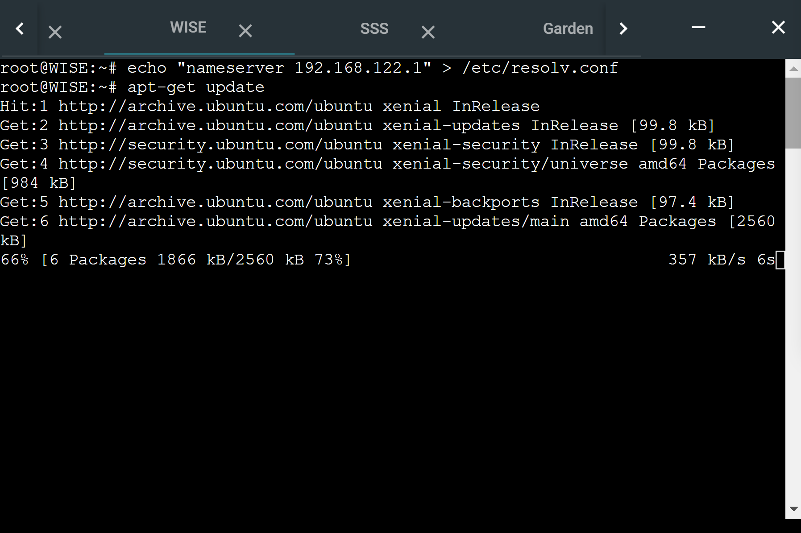
 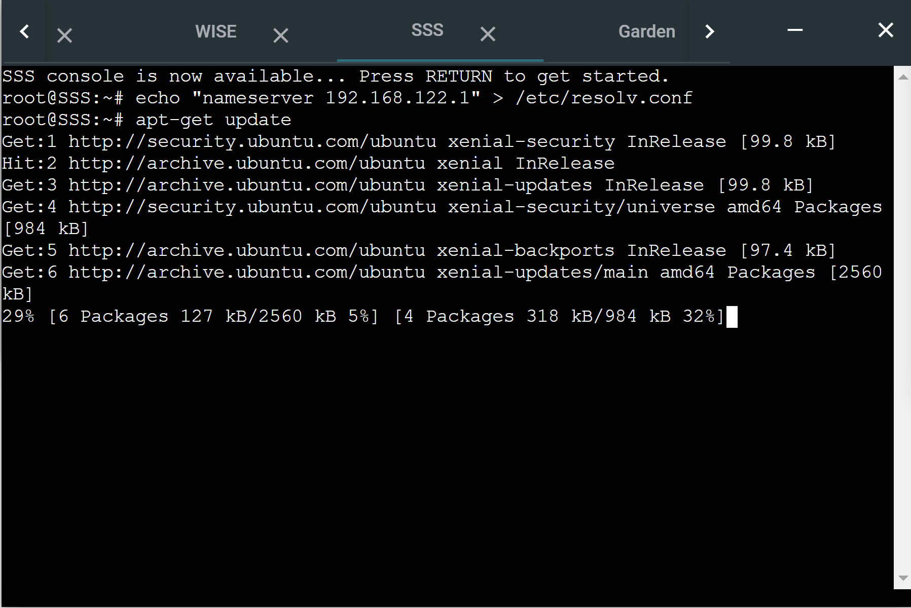
 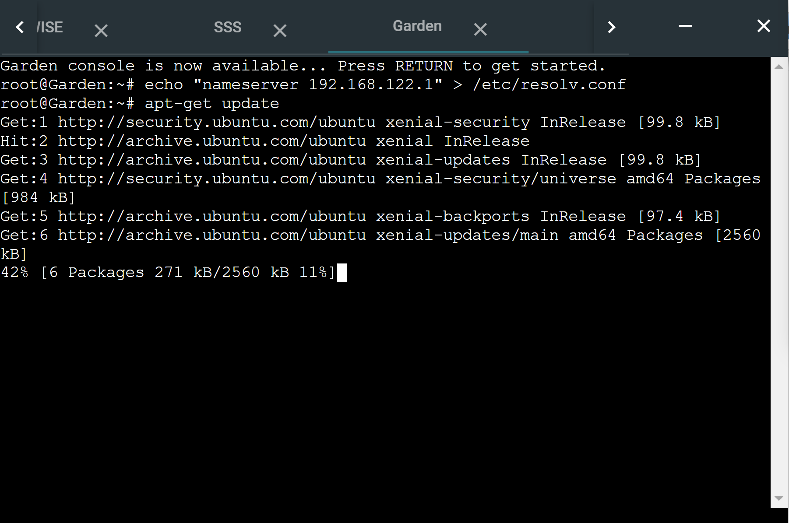
 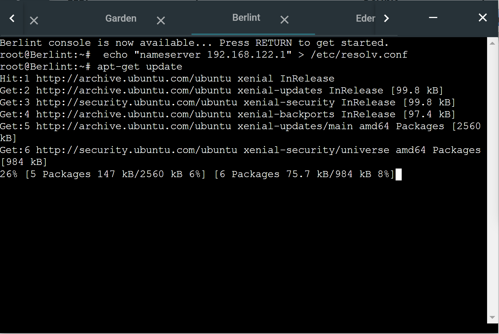
 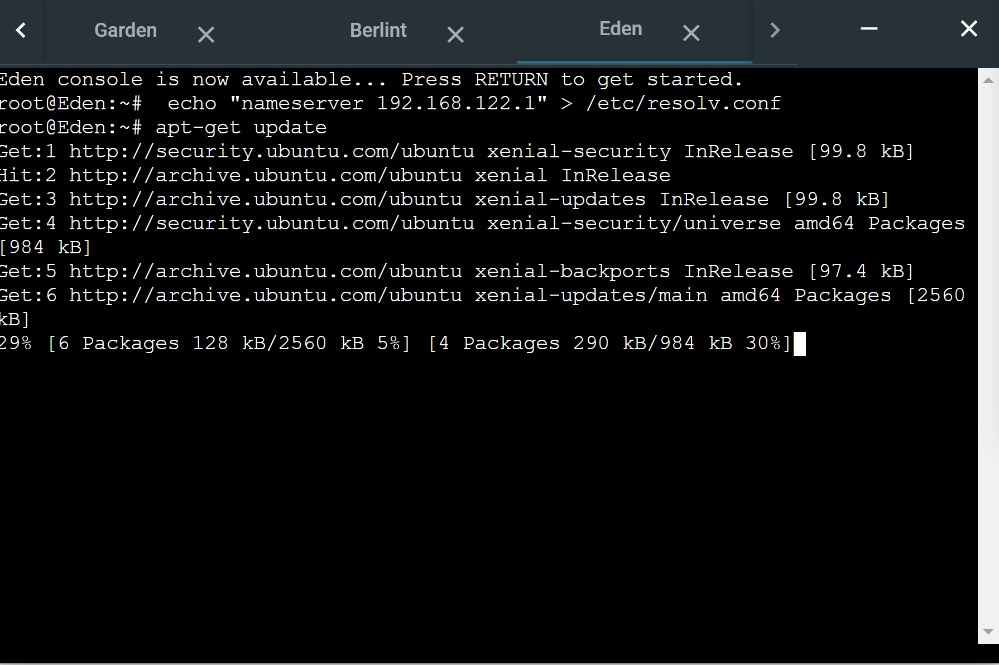
 
## Soal 2
***Untuk mempermudah mendapatkan informasi mengenai misi dari Handler, bantulah Loid membuat website utama dengan akses wise.yyy.com dengan alias www.wise.yyy.com pada folder wise***<br><br>
Membuat website utama dan tambahkan record CNAME wise.b08.com pada folder wise.
```
echo 'zone "wise.b08.com" {
        type master;
        file "/etc/bind/wise/wise.b08.com";
};' > /etc/bind/named.conf.local
mkdir /etc/bind/wise
echo "
\$TTL    604800
@       IN      SOA     wise.b08.com. root.wise.b08.com. (
                        2               ; Serial
                        604800          ; Refresh
                        86400           ; Retry
                        2419200         ; Expire
                        604800 )        ; Negative Cache TTL
;
@               IN      NS      wise.b08.com.
@               IN      A       10.7.3.2 ; IP Wise
www             IN      CNAME   wise.b08.com.
" > /etc/bind/wise/wise.b08.com
```

Melakukan restart bind9 `service bind9 restart`

	
**TESTING**
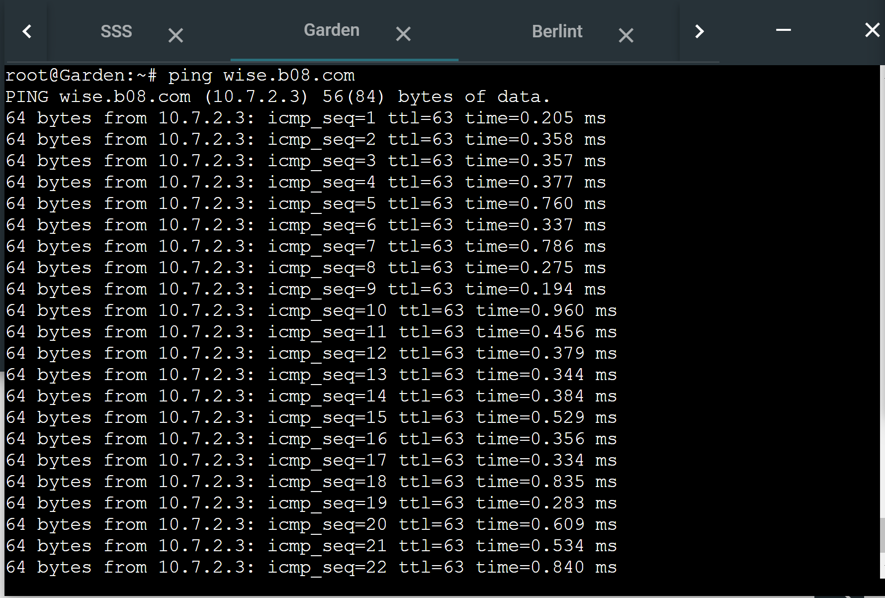

## Soal 3
***Setelah itu ia juga ingin membuat subdomain eden.wise.yyy.com dengan alias www.eden.wise.yyy.com yang diatur DNS-nya di WISE dan mengarah ke Eden***<br><br>
Membuat subdomain eden.wise.b08.com beserta CNAME nya yang mengarah ke Eden pada console wise.
```
echo "
\$TTL    604800
@       IN      SOA     wise.b08.com. root.wise.b08.com. (
                                2       ; Serial
                        604800          ; Refresh
                        86400           ; Retry
                        2419200         ; Expire
                        604800 )        ; Negative Cache TTL
;
@               IN      NS      wise.b08.com.
@               IN      A       10.7.3.2 ; IP Wise
www             IN      CNAME   wise.b08.com.
eden            IN      A       10.7.2.3 ; IP Eden
www.eden        IN      CNAME   eden.wise.b08.com.
" > /etc/bind/wise/wise.b08.com
```

Melakukan restart bind9 `service bind9 restart`

	
**TESTING**
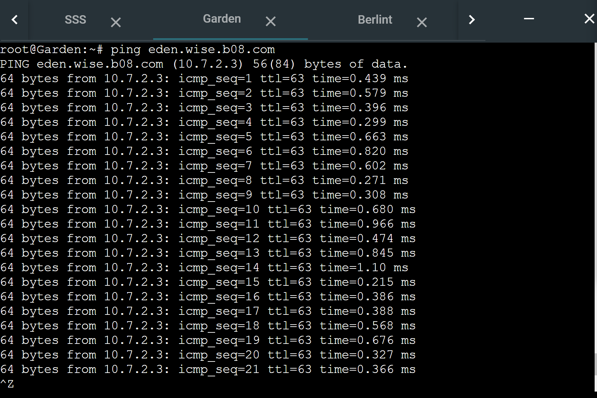

## Soal 4
***Buat juga reverse domain untuk domain utama***<br><br>
Membuat reverse yang merupakan keterbalikan prefix. Kelompok kami memiliki prefix 10.7 maka akan menjadi 7.10. Sehingga dibuat file baru yang berisi code pada no. 2 dan diganti prefixnya menjadi seperti di bawah ini pada console wise.
```
echo '
zone "wise.b08.com" {
        type master;
        file "/etc/bind/wise/wise.b08.com";
};

zone "2.7.10.in-addr.arpa" {
        type master;
        file "/etc/bind/wise/2.7.10.in-addr.arpa";
};' > /etc/bind/named.conf.local

echo "
\$TTL    604800
@       IN      SOA     wise.b08.com. root.wise.b08.com. (
                                2       ; Serial
                        604800          ; Refresh
                        86400           ; Retry
                        2419200         ; Expire
                        604800 )        ; Negative Cache TTL
;
2.7.10.in-addr.arpa.    IN      NS      wise.b08.com.
2                       IN      PTR     wise.b08.com.
"> /etc/bind/wise/2.7.10.in-addr.arpa
```
<br>
	
Melakukan restart bind9 `service bind9 restart`

	
**TESTING**
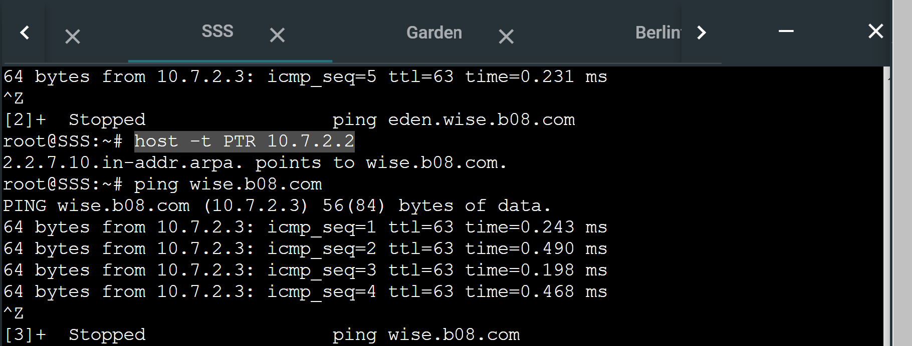

## Soal 5
***Agar dapat tetap dihubungi jika server WISE bermasalah, buatlah juga Berlint sebagai DNS Slave untuk domain utama***<br><br>
Apabila bermasalah akan menghubungi Berlint yang dideklarasikan sebagai DNS Slave (nomor 1) pada console wise
	
```
echo '
zone "wise.b08.com" {
        type master;
        notify yes;
        also-notify {10.7.2.2;};  //IP Berlint 
        allow-transfer {10.7.2.2;}; //IP Berlint 
        file "/etc/bind/wise/wise.b08.com";
};

zone "2.7.10.in-addr.arpa" {
        type master;
        file "/etc/bind/wise/2.7.10.in-addr.arpa";
};' > /etc/bind/named.conf.local
```
	
<br>
	
Melakukan restart bind9 `service bind9 restart`. Lalu, Tambahkan deklarasi pada Garden dan juga Eden
	
```
echo "
nameserver 10.7.3.2  //IP WISE
nameserver 10.7.2.2  //IP BERLINT
nameserver 10.7.2.3  //IP EDEN

" > /etc/resolv.conf
```
	
Jangan lupa untuk menginstall dnsutils dan lynx pada Garden dan Eden
	
```
apt-get install dnsutils -y
apt-get install lynx -y
```

**TESTING**
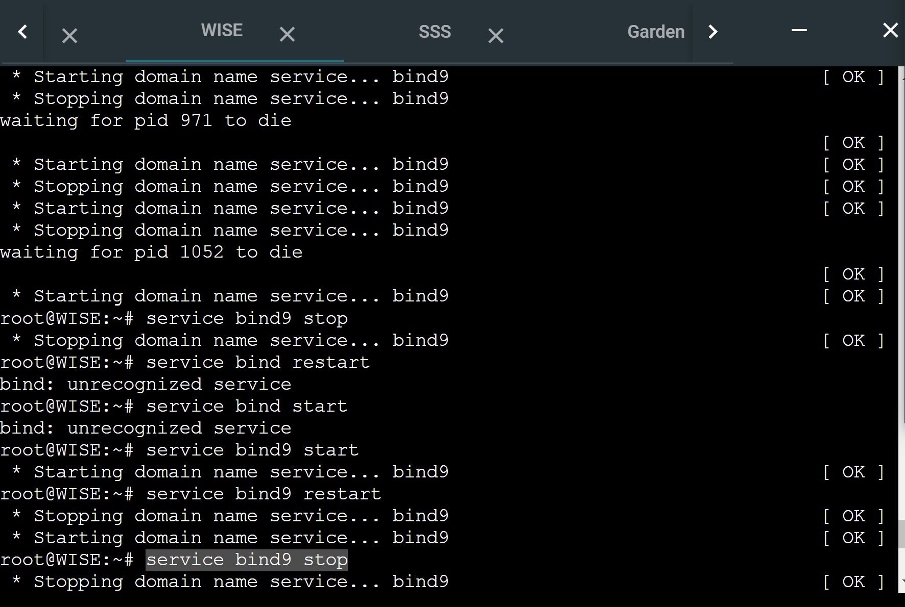
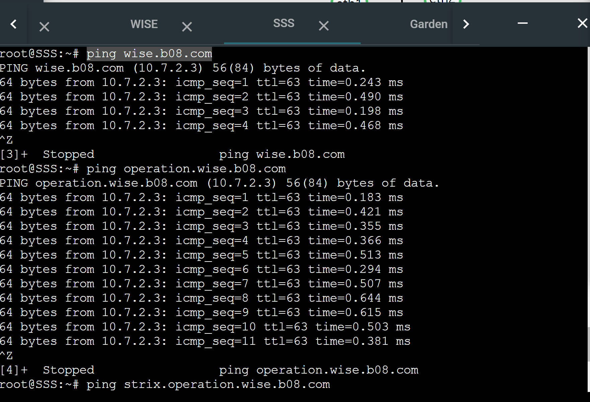

## Soal 6
***Karena banyak informasi dari Handler, buatlah subdomain yang khusus untuk operation yaitu operation.wise.yyy.com dengan alias www.operation.wise.yyy.com yang didelegasikan dari WISE ke Berlint dengan IP menuju ke Eden dalam folder operation***<br><br>
Menambahkan subdomain untuk operation yaitu operation.wise.b08.com beserta CNAME. Berikut code yang dimasukkan ke dalam WISE:
	
```
echo "
\$TTL    604800
@       IN      SOA     wise.b08.com. root.wise.b08.com. (
                        2               ; Serial
                        604800          ; Refresh
                        86400           ; Retry
                        2419200         ; Expire
                        604800 )        ; Negative Cache TTL
;
@               IN      NS      wise.b08.com.
@               IN      A       10.7.2.3 ; IP Eden
www             IN      CNAME   wise.b08.com.
eden            IN      A       10.7.2.3 ; IP Eden
www.eden        IN      CNAME   eden.wise.b08.com.
ns1             IN      A       10.7.2.2; IP Berlint
operation       IN      NS      ns1
"> /etc/bind/wise/wise.b08.com

echo "
options {
        directory \"/var/cache/bind\";

        allow-query{any;};
        auth-nxdomain no;    # conform to RFC1035
        listen-on-v6 { any; };
};
" > /etc/bind/named.conf.options

echo '
zone "wise.b08.com" {
        type master;
        //notify yes;
        //also-notify {10.7.2.2;};  Masukan IP Berlint 
        file "/etc/bind/wise/wise.b08.com";
        allow-transfer {10.7.2.2;}; // Masukan IP Berlint 
};

zone "2.7.10.in-addr.arpa" {
        type master;
        file "/etc/bind/wise/2.7.10.in-addr.arpa";
};
' >  /etc/bind/named.conf.local
```
	
<br>
	
Melakukan restart bind9 `service bind9 restart`
	
<br>
	
Berikut code yang dimasukkan ke dalam Berlint:
	
```
echo "
options {
        directory \"/var/cache/bind\";
        allow-query{any;};
        auth-nxdomain no;    # conform to RFC1035
        listen-on-v6 { any; };
};
" > /etc/bind/named.conf.options
echo '
zone "wise.b08.com" {
        type slave;
        masters { 10.7.3.2; }; // Masukan IP Wise 
        file "/var/lib/bind/wise.b08.com";
};

zone "operation.wise.b08.com"{
        type master;
        file "/etc/bind/operation/operation.wise.b08.com";
};
'> /etc/bind/named.conf.local
mkdir /etc/bind/operation
echo "
\$TTL    604800
@       IN      SOA     operation.wise.b08.com. root.operation.wise.b08.com. (
                        2             ; Serial
                        604800        ; Refresh
                        86400         ; Retry
                        2419200       ; Expire
                        604800 )      ; Negative Cache TTL
;
@               IN      NS              operation.wise.b08.com.
@               IN      A               10.7.2.3       ;IP Eden
www             IN      CNAME           operation.wise.b08.com.
" > /etc/bind/operation/operation.wise.b08.com
```
	
Melakukan restart bind9 `service bind9 restart`

**TESTING**
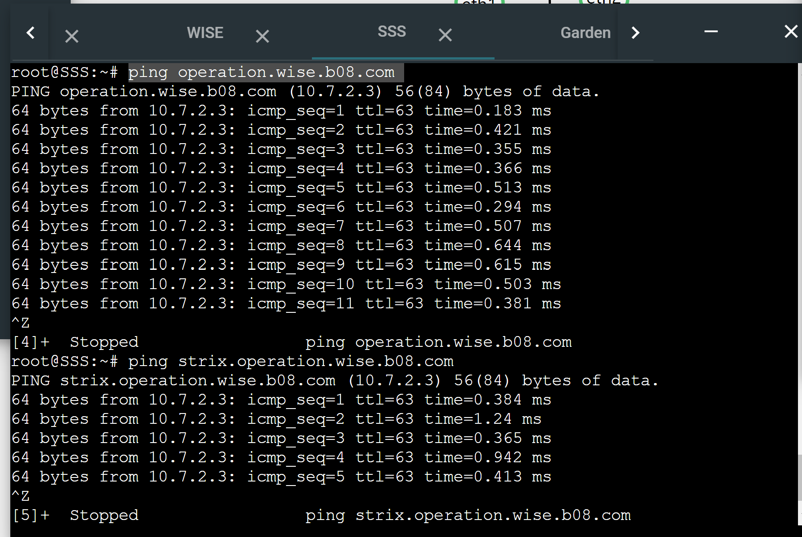

## Soal 7
***Untuk informasi yang lebih spesifik mengenai Operation Strix, buatlah subdomain melalui Berlint dengan akses strix.operation.wise.yyy.com dengan alias www.strix.operation.wise.yyy.com yang mengarah ke Eden***<br><br>
Membuat subdomain strix.operation.wise.b08.com dengan CNAMEnya pada berlint 
```
echo "
\$TTL    604800
@       IN      SOA     operation.wise.b08.com. root.operation.wise.b08.com. (
                        2             ; Serial
                        604800        ; Refresh
                        86400         ; Retry
                        2419200       ; Expire
                        604800 )      ; Negative Cache TTL
;
@               IN      NS              operation.wise.b08.com.
@               IN      A               10.7.2.3       ;IP Eden
www             IN      CNAME           operation.wise.b08.com.
strix           IN      A               10.7.2.3       ;IP Eden
www.strix       IN      CNAME           strix.operation.wise.b08.com.
" > /etc/bind/operation/operation.wise.b08.com
```
<br>
Melakukan restart bind9 `service bind9 restart`

**TESTING**
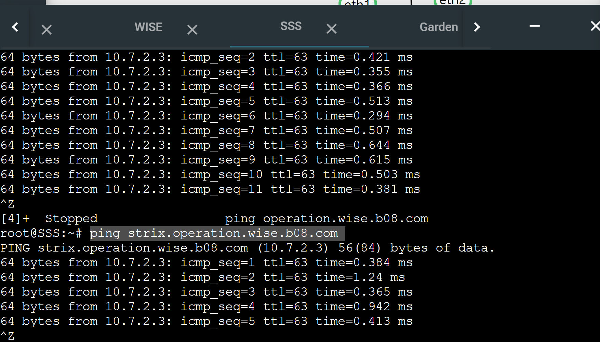

## Soal 8
***Setelah melakukan konfigurasi server, maka dilakukan konfigurasi Webserver. Pertama dengan webserver www.wise.yyy.com. Pertama, Loid membutuhkan webserver dengan DocumentRoot pada /var/www/wise.yyy.com***<br><br>

**Client Garden**   
Melakukan `apt-get update` dengan cara    
```
apt-get update
```
  
**Server Eden**      
Melakukan instalasi Apache, php, openssl untuk melakukan download ke website https dengan cara
```
apt-get install apache2 -y
service apache2 start
apt-get install php -y
apt-get install libapache2-mod-php7.0 -y
service apache2 
apt-get install ca-certificates openssl -y
```
konfigurasi file `/etc/apache2/sites-available/wise.b08.com.conf`. DcumentRoot diletakkan  di /var/www/wise.b08.com. Jangan lupa untuk menambah servername dan serveralias  
```
<VirtualHost *:80>

        ServerAdmin webmaster@localhost
        DocumentRoot /var/www/wise.b08.com
        ServerName wise.b08.com
        ServerAlias www.wise.b08.com

        ErrorLog \${APACHE_LOG_DIR}/error.log
        CustomLog \${APACHE_LOG_DIR}/access.log combined
</VirtualHost>
```
Lalu lakukan membuat sebuah direkroti root untuk server wise.b08.com dan melakukan copy file content
```
a2ensite wise.b08.com
mkdir /var/www/wise.b08.com
cp -r /root/Jarkom-Modul-2-B08-2022/wise/. /var/www/wise.b08.com
service apache2 restart
```

**TESTING**
	
Test dengan `lynx wise.b08.com`
	
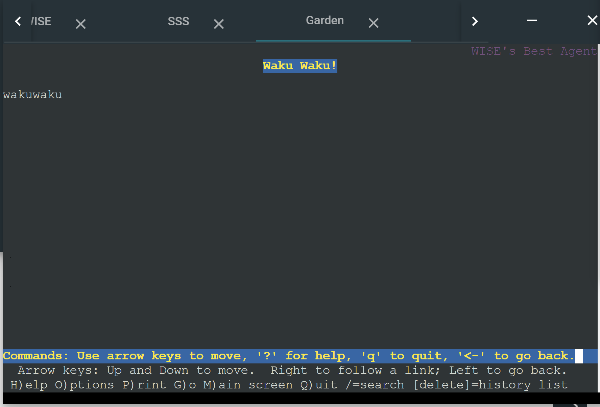
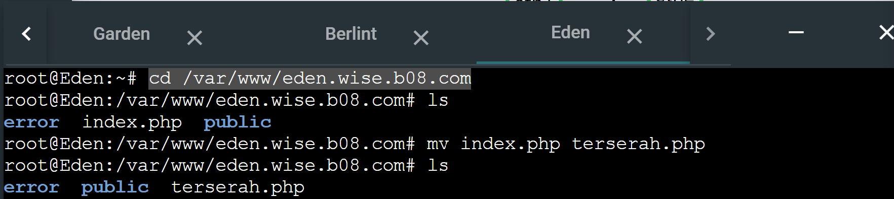


## Soal 9
***Setelah itu, Loid juga membutuhkan agar url www.wise.yyy.com/index.php/home dapat menjadi menjadi www.wise.yyy.com/home***<br><br>
	
**Server Eden**     
konfigurasi file `/var/www/wise.b08.com/.htaccess` dengan    
```
a2enmod rewrite
service apache2 restart
echo "
RewriteEngine On
RewriteCond %{REQUEST_FILENAME} !-f
RewriteCond %{REQUEST_FILENAME} !-d
RewriteRule (.*) /index.php/\$1 [L]
```
Inti dari konfigurasi tersebut adalah kita melakukan cek apakah request tersebut adalah ke file atau bukan dan ke direktori atau bukan jika hal tersebut terpenuhi aka kita membuat rule untuk melakukan direct ke /index.php/home. $1 merupakan parameter yang diinputkan di url
konfigurasi file `/etc/apache2/sites-available/wise.b08.com.conf` dengan  
```
<VirtualHost *:80>
        ServerAdmin webmaster@localhost
        DocumentRoot /var/www/wise.b08.com
        ServerName wise.b08.com
        ServerAlias www.wise.b08.com

        ErrorLog \${APACHE_LOG_DIR}/error.log
        CustomLog \${APACHE_LOG_DIR}/access.log combined

        <Directory /var/www/wise.b08.com>
                Options +FollowSymLinks -Multiviews
                AllowOverride All
        </Directory>
</VirtualHost>
```
Melakukan restart service apache2 dengan `service apache2 restart`	

**TESTING**
	
Test dengan `lynx www.wise.b08.com/home`
	
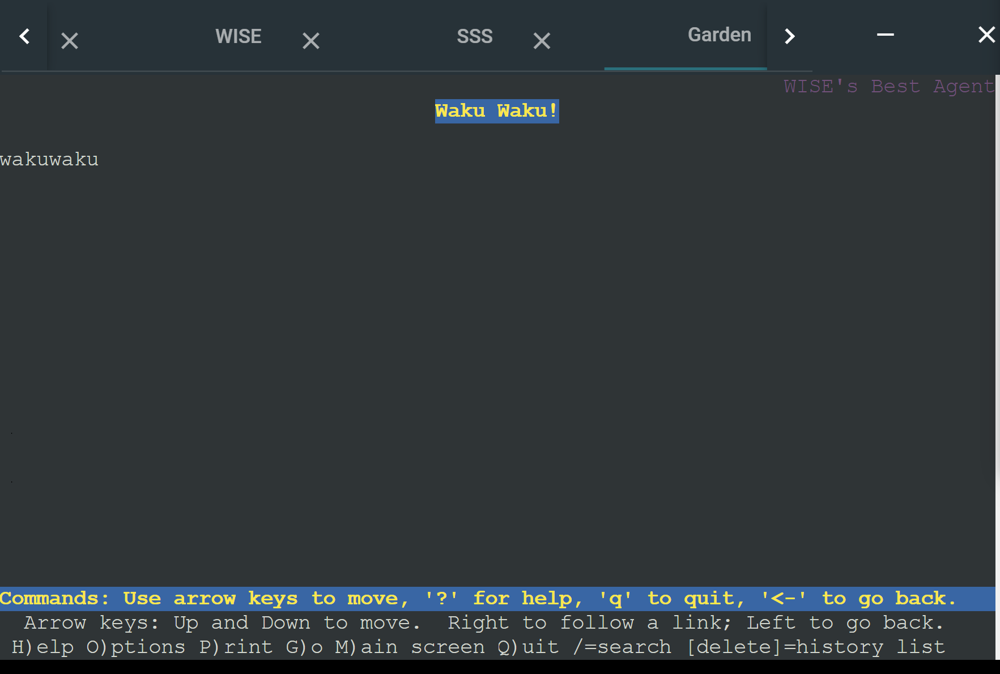

## Soal 10
***Setelah itu, pada subdomain www.eden.wise.yyy.com, Loid membutuhkan penyimpanan aset yang memiliki DocumentRoot pada /var/www/eden.wise.yyy.com***<br><br>
	
**Server Eden**    
konfigurasi file `/etc/apache2/sites-available/eden.wise.b08.com.conf` dengan  
```
<VirtualHost *:80>
        ServerAdmin webmaster@localhost
        DocumentRoot /var/www/eden.wise.b08.com
        ServerName eden.wise.b08.com
        ServerAlias www.eden.wise.b08.com

        ErrorLog \${APACHE_LOG_DIR}/error.log
        CustomLog \${APACHE_LOG_DIR}/access.log combined

        <Directory /var/www/wise.b08.com>
                Options +FollowSymLinks -Multiviews
                AllowOverride All
        </Directory>
</VirtualHost>
```
Lalu aktifkan virtualhost dengan a2ensite, membuat direktori untuk documentroot di /var/www.eden.wise.b08.com dan jangan lupa untuk melakukan copy content ke documentroot dengan cara
```
a2ensite super.franky.t07.com
mkdir /var/www/super.franky.t07.com
cp -r /root/Praktikum-Modul-2-Jarkom/super.franky/. /var/www/super.franky.t07.com
service apache2 restart
```
konfigurasi file `/var/www/eden.wise.b08.com/index.php` dengan `echo "<?php echo 'tes.. ini nomor 10' ?>"`

**TESTING**

Test dengan `lynx www.eden.wise.b08.com/home`

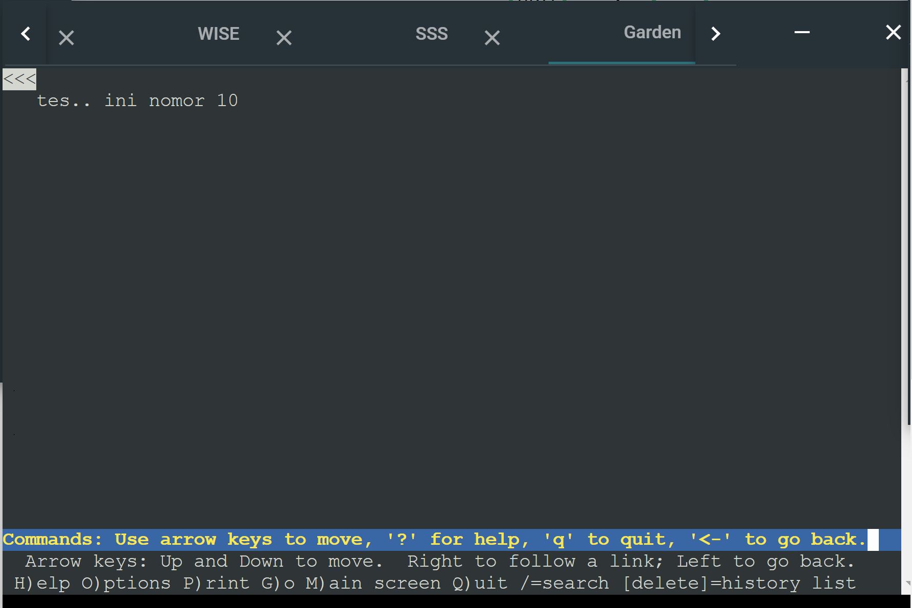

## Soal 11
***Akan tetapi, pada folder /public, Loid ingin hanya dapat melakukan directory listing saja***<br><br>
	
**Server Eden**    
konfigurasi file `/etc/apache2/sites-available/eden.wise.b08.com.conf` menamahkan Options +Indexes ke direktori yang ingin di directory list dengan  
```
<VirtualHost *:80>

        ServerAdmin webmaster@localhost
        DocumentRoot /var/www/eden.wise.b08.com
        ServerName eden.wise.b08.com
        ServerAlias www.eden.wise.b08.com

        <Directory /var/www/eden.wise.b08.com/public>
                Options +Indexes
        </Directory>

        ErrorLog \${APACHE_LOG_DIR}/error.log
        CustomLog \${APACHE_LOG_DIR}/access.log combined

        <Directory /var/www/wise.b08.com>
                Options +FollowSymLinks -Multiviews
                AllowOverride All
        </Directory>
</VirtualHost>
```     
Melakukan restart service apache2 dengan `service apache2 restart` 

**TESTING**


## Soal 12
***Tidak hanya itu, Loid juga ingin menyiapkan error file 404.html pada folder /error untuk mengganti error kode pada apache***<br><br>
	
**Server Eden**    
konfigurasi file `/etc/apache2/sites-available/eden.wise.b08.com.conf` menambahkan konfigurasi ErrorDocument untuk setiap error yang ada yang diarahkan ke file /error/404.html dengan  
```
<VirtualHost *:80>
        ServerAdmin webmaster@localhost
        DocumentRoot /var/www/eden.wise.b08.com
        ServerName eden.wise.b08.com
        ServerAlias www.eden.wise.b08.com

        ErrorDocument 404 /error/404.html
        ErrorDocument 500 /error/404.html
        ErrorDocument 502 /error/404.html
        ErrorDocument 503 /error/404.html
        ErrorDocument 504 /error/404.html

        <Directory /var/www/eden.wise.b08.com/public>
                Options +Indexes
        </Directory>

        ErrorLog \${APACHE_LOG_DIR}/error.log
        CustomLog \${APACHE_LOG_DIR}/access.log combined

        <Directory /var/www/wise.b08.com>
                Options +FollowSymLinks -Multiviews
                AllowOverride All
        </Directory>
</VirtualHost>
```     
Melakukan restart service apache2 dengan `service apache2 restart`   

**TESTING**
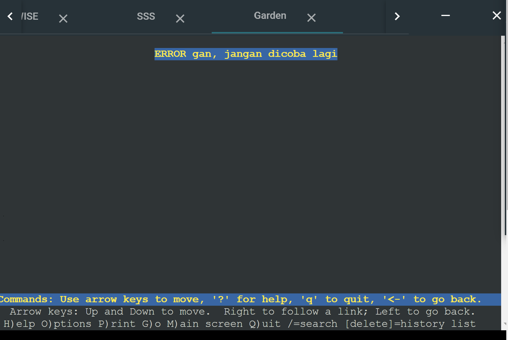

## Soal 13
***Loid juga meminta Franky untuk dibuatkan konfigurasi virtual host. Virtual host ini bertujuan untuk dapat mengakses file asset www.eden.wise.yyy.com/public/js menjadi www.eden.wise.yyy.com/js***<br><br>
	
**Server Eden**
Konfigurasi File `/etc/apache2/sites-avalaible/eden.wise.b08.com.conf` untuk menambahkan konfigurasi Alias dengan
```
<VirtualHost *:80>

        ServerAdmin webmaster@localhost
        DocumentRoot /var/www/eden.wise.b08.com
        ServerName eden.wise.b08.com
        ServerAlias www.eden.wise.b08.com

        ErrorDocument 404 /error/404.html
        ErrorDocument 500 /error/404.html
        ErrorDocument 502 /error/404.html
        ErrorDocument 503 /error/404.html
        ErrorDocument 504 /error/404.html

        <Directory /var/www/eden.wise.b08.com/public>
                Options +Indexes
        </Directory>

        Alias \"/js\" \"/var/www/eden.wise.b08.com/public/js\"


        ErrorLog \${APACHE_LOG_DIR}/error.log
        CustomLog \${APACHE_LOG_DIR}/access.log combined

        <Directory /var/www/eden.wise.b08.com>
                Options +FollowSymLinks -Multiviews
                AllowOverride All
        </Directory>
</VirtualHost>
```
Melakukan restart service apache2 dengan `service apache2 restart`
	
	
**TESTING**
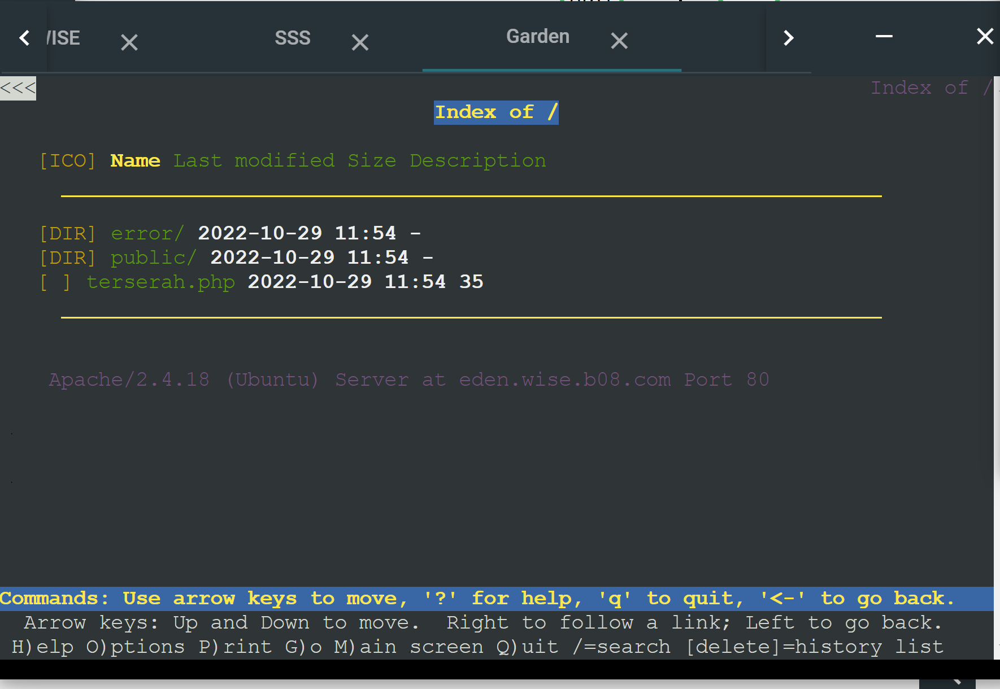
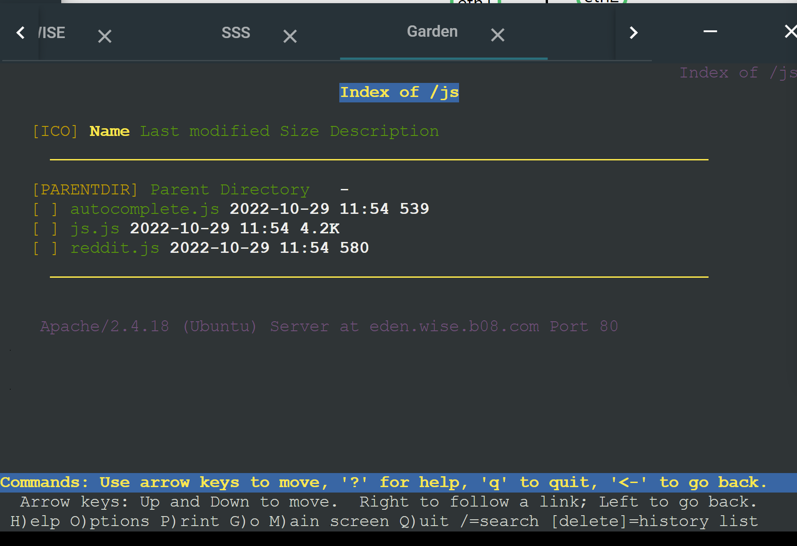
	
## Soal 14
***Loid meminta agar www.strix.operation.wise.yyy.com hanya bisa diakses dengan port 15000 dan port 15500***<br><br>

**Server Eden**
Konfigurasi file `/etc/apache2/sites-available/strix.operation.wise.b08.com.conf` disini menambahkan VirtualHost baru pada port 15000 dan 15500 dengan
```
<VirtualHost *:15000>

        ServerAdmin webmaster@localhost
        DocumentRoot /var/www/strix.operation.wise.b08.com
        ServerName strix.operation.wise.b08.com
        ServerAlias www.strix.operation.wise.b08.com


        ErrorLog \${APACHE_LOG_DIR}/error.log
        CustomLog \${APACHE_LOG_DIR}/access.log combined
</VirtualHost>
<VirtualHost *:15500>        
        ServerAdmin webmaster@localhost
        DocumentRoot /var/www/strix.operation.wise.b08.com
        ServerName strix.operation.wise.b08.com
        ServerAlias www.strix.operation.wise.b08.com
        

        ErrorLog \${APACHE_LOG_DIR}/error.log
        CustomLog \${APACHE_LOG_DIR}/access.log combined
</VirtualHost>
```
Selanjutnya lakukan
```
a2ensite strix.operation.wise.b08.com
service apache2 restart
mkdir /var/www/strix.operation.wise.b08.com
cp -r /root/Jarkom-Modul-2-B08-2022/strix.operation.wise/. /var/www/strix.operation.wise.b08.com/
```
Konfigurasi File `/var/www/strix.operation.wise.b08.com/index.php` dengan
```
<?php
        echo 'no. 14';
?>
```
Konfigurasi file `/etc/apache2/ports.conf` untuk menambahkan Listen port 15000 dan 15500 dengan
```
Listen 80
Listen 15000
Listen 15500
<IfModule ssl_module>
        Listen 443
</IfModule>

<IfModule mod_gnutls.c>
        Listen 443
</IfModule>
```
melakukan restart apache2 dengan `service apache2 restart`
	
**TESTING**


## Soal 15
***dengan autentikasi username Twilight dan password opStrix dan file di /var/www/strix.operation.wise.yyy***<br><br>
	
**Server Eden**
Jalankan Command `htpasswd -c -b /etc/apache2/.htpasswd Twilight opStrix`
Konfigurasi file `/etc/apache2/sites-available/strix.operation.wise.b08.com.conf` dengan
```
<VirtualHost *:15000>

        ServerAdmin webmaster@localhost
        DocumentRoot /var/www/strix.operation.wise.b08.com
        ServerName strix.operation.wise.b08.com
        ServerAlias www.strix.operation.wise.b08.com

        <Directory \"/var/www/strix.operation.wise.b08.com\">
                AuthType Basic
                AuthName \"Restricted Content\"
                AuthUserFile /etc/apache2/.htpasswd
                Require valid-user
        </Directory>

        ErrorLog \${APACHE_LOG_DIR}/error.log
        CustomLog \${APACHE_LOG_DIR}/access.log combined
</VirtualHost>
<VirtualHost *:15500>        
        ServerAdmin webmaster@localhost
        DocumentRoot /var/www/strix.operation.wise.b08.com
        ServerName strix.operation.wise.b08.com
        ServerAlias www.strix.operation.wise.b08.com
        
        <Directory \"/var/www/strix.operation.wise.b08.com\">
                AuthType Basic
                AuthName \"Restricted Content\"
                AuthUserFile /etc/apache2/.htpasswd
                Require valid-user
        </Directory>
        
        ErrorLog \${APACHE_LOG_DIR}/error.log
        CustomLog \${APACHE_LOG_DIR}/access.log combined
</VirtualHost>
```
Melakukan restart apache2 dengan ` service apache2 restart`

**TESTING**
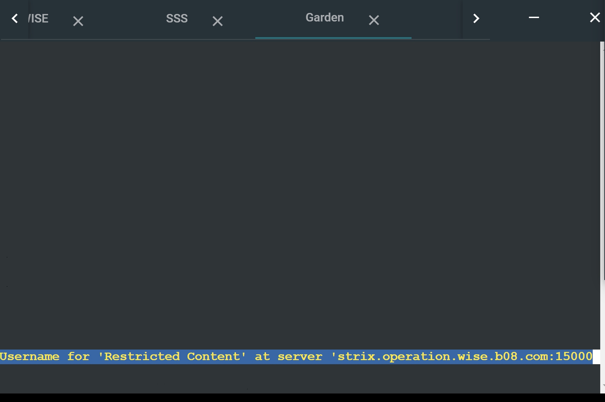

## Soal 16
***dan setiap kali mengakses IP Eden akan dialihkan secara otomatis ke www.wise.yyy.com**<br><br>
	
**Server Eden**
Konfigurasi file `/etc/apache2/sites-available/000-default.conf` dengan 
```
<VirtualHost *:80>

        ServerAdmin webmaster@localhost
        DocumentRoot /var/www/html

        RewriteEngine On
        RewriteCond %{HTTP_HOST} !^wise.b08.com$
        RewriteRule /.* http://wise.b08.com/ [R]

        ErrorLog \${APACHE_LOG_DIR}/error.log
        CustomLog \${APACHE_LOG_DIR}/access.log combined

</VirtualHost>
```
melakukan restart apache2 dengan `service apache2 restart`

**TESTING**
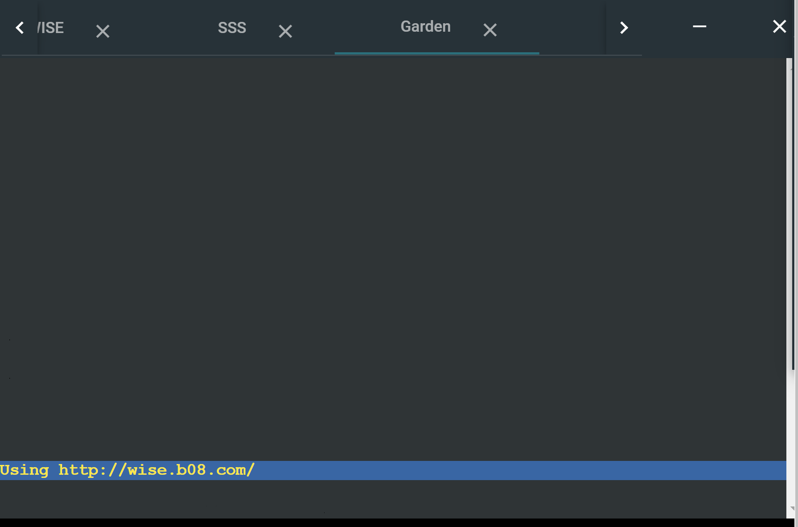

## Soal 17
***Karena website www.eden.wise.yyy.com semakin banyak pengunjung dan banyak modifikasi sehingga banyak gambar-gambar yang random, maka Loid ingin mengubah request gambar yang memiliki substring “eden” akan diarahkan menuju eden.png. Bantulah Agent Twilight dan Organisasi WISE menjaga perdamaian!***<br><br>

**Server Eden**
Konfigurasi `/var/www/eden.wise.b08.com/.htaccess` dengan
```
echo "
RewriteEngine On
RewriteCond %{REQUEST_URI} ^/public/images/(.*)eden(.*)
RewriteCond %{REQUEST_URI} !/public/images/eden.png
RewriteRule /.* http://eden.wise.b08.com/public/images/eden.png [L]
"
```
Konfigurasi file `/etc/apache2/sites-available/eden.wise.b08.com.conf` dengan
```
echo "
<VirtualHost *:80>

        ServerAdmin webmaster@localhost
        DocumentRoot /var/www/eden.wise.b08.com
        ServerName eden.wise.b08.com
        ServerAlias www.eden.wise.b08.com

        ErrorDocument 404 /error/404.html
        ErrorDocument 500 /error/404.html
        ErrorDocument 502 /error/404.html
        ErrorDocument 503 /error/404.html
        ErrorDocument 504 /error/404.html

        <Directory /var/www/eden.wise.b08.com/public>
                Options +Indexes
        </Directory>

        Alias \"/js\" \"/var/www/eden.wise.b08.com/public/js\"

        <Directory /var/www/eden.wise.b08.com>
                Options +FollowSymLinks -Multiviews
                AllowOverride All
        </Directory>
        ErrorLog \${APACHE_LOG_DIR}/error.log
        CustomLog \${APACHE_LOG_DIR}/access.log combined

        <Directory /var/www/wise.b08.com>
                Options +FollowSymLinks -Multiviews
                AllowOverride All
        </Directory>
</VirtualHost>
"
```
Melakukan restart apache2 dengan `service apache2 restart`

**TESTING**
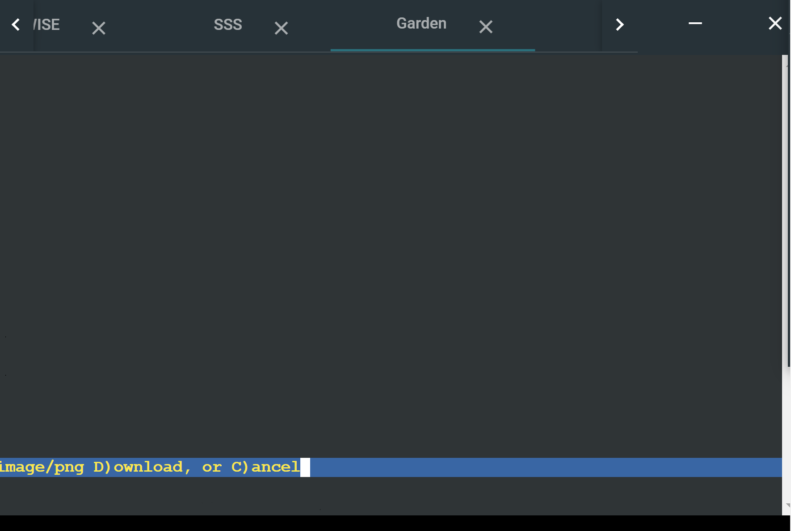


## Kendala
  + Aaliyah Farah Adibah
    	1. Baru dalam menggunakan GNS
	2. GNS sempat error saat awal-awal praktikum
	3. Internal Server Error saat diakhir-akhir padahal sudah mengikuti step-step yang ada di modul
	
  + Rafael Asi Kristanto Tambunan
	1. Penggunaan GNS yang masih baru
	2. GNS yang sering error saat digunakan

  + Sejati Bakti Raga
	1. Pemahaman GNS yang masih kurang
	2. GNS dan VM error ditengah pengerjaan
